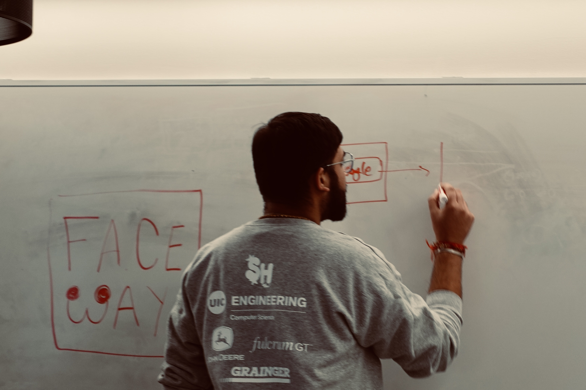

  

<i>Brainstorming session for the AI Facial Recognition project: FaceWAY</i>

# Hi, I'm Kirtan Patel

I'm a Computer Science grad student passionate about building secure, intelligent, and scalable solutions. Whether it's full-stack apps, AI-powered systems, or networked security tools — I love bringing ideas to life with code.

## 🔍 Interests
**Software Engineering** • **Systems Security** • **Cybersecurity** • **Applied AI for Security**

---

## 🚀 Current Focus

* Building **security-focused tooling** for vulnerability analysis, reporting, and automation
* Practicing **real-world penetration testing workflows** (enumeration → exploitation → privilege escalation)
* Developing **AI-assisted security utilities** using LLMs and RAG pipelines
* Strengthening fundamentals in **network, web, and system-level security** through hands-on labs

---

## 💬 Ask Me About

* Backend and full-stack development (Node.js, PostgreSQL, APIs)
* Secure software design and system architecture
* Web and network security fundamentals (Nmap, Wireshark, Burp)
* Python for automation, tooling, and backend services
* Using AI to augment software and security workflows (LLMs, RAG)

---

## 💌 How to Reach Me
**Email:** [official.kirtan13@gmail.com](mailto:official.kirtan13@gmail.com)  
**LinkedIn:** [linkedin.com/in/KirtanPatel13](https://www.linkedin.com/in/KirtanPatel13/)  
**GitHub:** [github.com/kirtanpatel2003](https://github.com/kirtanpatel2003)

---

## 🛡️ Cybersecurity Tools

## 🧐 AI/Automation Stack

## 📊 Data Tools

## 🌐 Full-Stack Development

---

## 📊 GitHub Stats

---

_"In the face of uncertainty, keep learning, keep building."_
